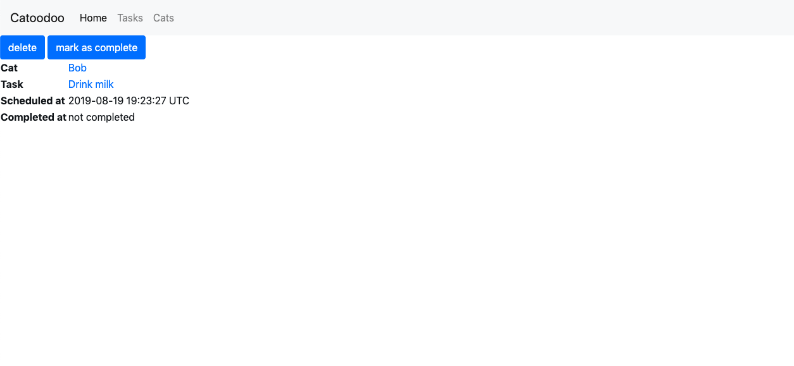
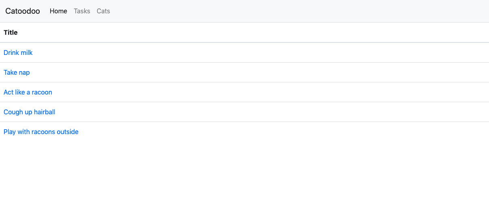

# Cattodoo 

Cattodoo is cat to do list which allows users to manage multiple cats and assign them tasks. 

### Technical Information

Different libraries such as Webpacker, Jquery and Bootstrap were utilized in this project. 

### Screenshots 

### Installation

Update the yarn bundle by running: 

## yarn install

To run the server: 

## rails s

open http://localhost:3000

Enjoy creating cats and assigning them tasks! 

